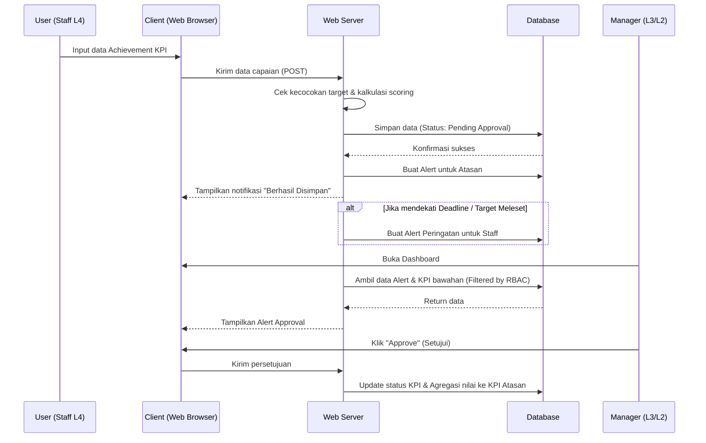
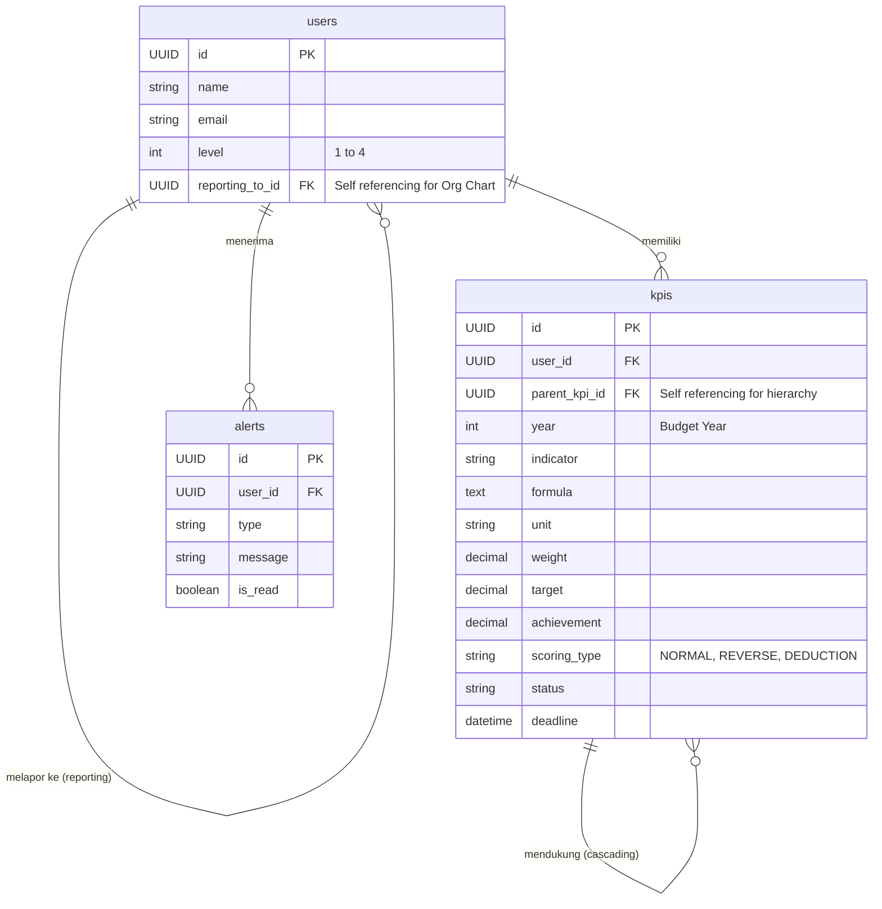

# PRD — Project Requirements Document

## 1. Overview
Dalam sebuah organisasi, sangat penting untuk menyelaraskan target kinerja dari level bawah hingga jajaran eksekutif. Saat ini, proses pemantauan Key Performance Indicator (KPI) seringkali tidak terhubung dengan baik antar level jabatan, menyulitkan pelacakan apakah performa staf benar-benar mendukung sasaran strategis perusahaan. 

Aplikasi **Monitoring Pencapaian KPI** ini hadir untuk menyelesaikan masalah tersebut dengan menyediakan platform terpusat dimana KPI disusun berjenjang (cascading) dalam 4 level: VP (Level 1), Manager (Level 2), Assistant Manager (Level 3), dan Staff (Level 4). Tujuan utama aplikasi ini adalah memudahkan pengisian target dan capaian kerja, memvisualisasikan data dalam bentuk tabel yang komprehensif, serta memberikan notifikasi (alert) otomatis agar setiap individu tetap fokus pada target dan tenggat waktu mereka. Selain itu, aplikasi ini menjamin keamanan data melalui kebijakan akses berbasis peran (RBAC), deployment on-premise, dan dukungan konfigurasi periode tahunan.

## 2. Requirements
- **Hierarki Berjenjang:** Sistem harus mewajibkan dan mampu menautkan KPI dari Level 4 (Staff) agar berkontribusi pada pencapaian KPI di level atasnya, terus hingga ke Level 1 (VP).
- **Fleksibilitas Input Data:** Sistem harus mendukung pengambilan data secara manual oleh pengguna maupun tarikan data dari sistem lain.
- **Perhitungan Semi-Otomatis:** Pencapaian dari level bawah akan diagregasi (dikumpulkan) ke level atas secara semi-otomatis, yang berarti butuh tinjauan atau persetujuan (approval) atasan.
- **Akses & Keamanan On-Premise:** Aplikasi sepenuhnya di-deploy di dalam server lokal (On-Premise) milik perusahaan untuk menjaga kerahasiaan data internal.
- **Sistem Pengingat Pintar:** Sistem harus bisa mengirimkan notifikasi spesifik berdasarkan kondisi (target meleset, mendekati tenggat waktu, perubahan data, dan permintaan persetujuan).
- **Pembatasan Visibilitas Data Berdasarkan Hierarki:** Sistem harus membatasi akses pandang data KPI sesuai dengan struktur organisasi. Pengguna hanya dapat melihat data dirinya sendiri dan data bawahan langsung maupun tidak langsung sesuai garis komando yang telah ditetapkan (detail pada Bagian 8).
- **Dukungan Metode Scoring Varian:** Sistem harus mendukung tiga metode perhitungan nilai: *Normal Scoring* (Realisasi/Target), *Reverse Scoring* (Target/Realisasi untuk metric yang semakin kecil semakin baik), dan *Deduction Scoring* (nilai pengurang).
- **Multi-Satuan & Konfigurasi Tahunan:** Sistem harus mampu menangani berbagai satuan (Rp, %, Hari, Gedung, dll) dan memungkinkan konfigurasi KPI per periode tahun anggaran (misal: 2026, 2027).

## 3. Core Features
- **Manajemen KPI (CRUD):** Fitur untuk membuat, membaca, mengubah, dan menghapus KPI. Setiap KPI akan memiliki kolom: Indikator Kinerja Kunci, Formula, Satuan, Bobot (%), Target, dan Pencapaian (Achievement).
- **Pemetaan Induk & Anak (Cascading KPI):** Fitur untuk mengaitkan KPI milik Staff (Level 4) sebagai komponen pendukung dari KPI Assistant Manager (Level 3), dan seterusnya hingga VP (Level 1).
- **Dashboard Detail Tabel:** Tampilan utama berupa tabel berlapis yang detail. Pengguna bisa melakukan *expand/collapse* (buka-tutup baris) untuk melihat bagaimana pencapaian tim di bawahnya mempengaruhi KPI mereka sendiri.
- **Sistem Notifikasi & Alert:** Pusat pemberitahuan otomatis yang menampilkan:
  - *Warning:* Jika pencapaian masih jauh di bawah target.
  - *Reminder:* Jika tenggat waktu pengisian/penilaian KPI sudah dekat.
  - *Info:* Jika ada perubahan data pada KPI yang berkaitan.
  - *Action:* Permintaan persetujuan (approval) capaian dari bawahan.
- **Siklus Approval (Persetujuan):** Fitur bagi atasan untuk menyetujui, merevisi, atau menolak capaian kinerja yang diajukan oleh level di bawahnya sebelum diagregasi ke atas.

### 3.1 KPI Level 1 (VP) Specification
Sistem harus mengimplementasikan spesifikasi khusus untuk Level 1 (Vice President) dengan struktur sebagai berikut:

**Total Bobot: 100%**
- **KPI Bersama:** 40%
- **KPI Bidang:** 60%

**Daftar Indikator Utama (10 KPI):**

1.  **EBIT (Bobot 10%)**
    -   *Formula:* EBIT = Laba (Rugi) Usaha + Laba Asosiasi & Ventura Bersama + Laba (Rugi) Selisih Kurs
    -   *Satuan:* Rp Miliar
    -   *Target 2026:* 1.565
    -   *Scoring:* Normal (Nilai = (Realisasi / Target) × 10)

2.  **Operating Ratio (Bobot 10%)**
    -   *Formula:* Operating Ratio = Biaya Usaha / Pendapatan Usaha
    -   *Satuan:* %
    -   *Target 2026:* 82,66%
    -   *Scoring:* Reverse (Semakin kecil semakin baik. Nilai = (Target / Realisasi) × 10)

3.  **Advancing in Sustainable Development Goals (Bobot 10%)**
    -   *Komponen:* Rata-rata pencapaian Maturity Level Sustainability & Pengelolaan Komunikasi & TJSL
    -   *Satuan:* %
    -   *Target:* Sesuai RKAP 2026
    -   *Scoring:* Normal (Nilai = (Rata-rata Realisasi / Target) × 10)

4.  **Pengembangan Talenta, Produktivitas, HC Services & Safety Culture (Bobot 10%)**
    -   *Komponen:* Rata-rata (Peningkatan Produktivitas Pegawai, LTIFR, Target Keikutsertaan Lomba Karya Inovasi PLN)
    -   *Satuan:* %
    -   *Target:* 100%
    -   *Scoring:* Normal (Nilai = (Rata-rata Realisasi / 100) × 10)

5.  **Compliance (Nilai Pengurang Maksimal -10)**
    -   *Komponen:* Maturity Level GCG, Kepatuhan HSSE, Tindak lanjut SPI/BPK/Auditor, Keterlambatan laporan, Ketidaksesuaian Corporate Charter, Major Cyber Security Incident, PACA, Critical Event, Non Allowable Cost (NAC).
    -   *Scoring:* Deduction (Pengurang nilai final)

6.  **Smart & Green Building (Bobot 12%)**
    -   *Deskripsi:* Jumlah implementasi Smart & Green Building
    -   *Satuan:* Gedung
    -   *Target:* 10
    -   *Scoring:* Normal (Nilai = (Realisasi / 10) × 12)

7.  **Penyelesaian Solusi Kebutuhan Pelanggan (Bobot 12%)**
    -   *Formula:* Jumlah permintaan selesai / jumlah permintaan kebutuhan sales
    -   *Satuan:* %
    -   *Target:* 100%
    -   *Scoring:* Normal (Nilai = (Realisasi / 100) × 12)

8.  **Waktu Penyelesaian Proposal (Bobot 12%)**
    -   *Deskripsi:* Rata-rata hari penyelesaian proposal
    -   *Satuan:* Hari
    -   *Target:* 10 Hari
    -   *Scoring:* Reverse (Semakin kecil semakin baik. Nilai = (Target / Realisasi) × 12)

9.  **Tingkat Keberhasilan Proposal / Win Rate (Bobot 12%)**
    -   *Formula:* Proposal menjadi PO / menang tender
    -   *Satuan:* %
    -   *Target:* 100%
    -   *Scoring:* Normal (Nilai = (Realisasi / 100) × 12)

10. **Identifikasi Kebutuhan Solusi Bisnis PLN Group (Bobot 12%)**
    -   *Deskripsi:* Pekerjaan disetujui PLN Group di luar penugasan DIVSTI
    -   *Satuan:* %
    -   *Target:* 100%
    -   *Scoring:* Normal (Nilai = (Realisasi / 100) × 12)

## 4. User Flow
1. **Login:** Pengguna (VP/Mgr/Asst Mgr/Staff) masuk menggunakan kredensial mereka.
2. **Lihat Dashboard:** Pengguna langsung diarahkan ke Dashboard Tabel Detail yang menampilkan daftar KPI milik mereka beserta status capaiannya (sesuai hak akses RBAC).
3. **Input KPI & Capaian:** 
   - Di awal periode, pengguna membuat/mengisi Indikator, Satuan, Bobot, dan Target.
   - Di akhir/pertengahan periode, pengguna memasukkan data "Achievement" (Pencapaian) secara manual atau sistem menarik data.
4. **Validasi & Agregasi:** Pengguna di Level bawah (misal Staff) menekan tombol "Submit".
5. **Notifikasi Atasan:** Atasan (Asst Manager) menerima *Alert* bahwa persetujuan dibutuhkan (Approval).
6. **Review:** Atasan meninjau capaian di dashboard tabelnya. Jika disetujui, angka capaian staf akan masuk ke dalam kalkulasi pencapaian KPI atasan tersebut (semi-otomatis).
7. **Peringatan (Opsional):** Jika dalam prosesnya sebuah KPI mendekati tenggat waktu belum diisi, atau realisasinya tidak capai target, sistem akan memunculkan *Alert* seketika.

## 5. Architecture
Aplikasi ini menggunakan rancangan *Client-Server* standar yang di-hosting secara internal (On-Premise). Klien (Browser pengguna) akan berinteraksi dengan Web Server untuk meminta antarmuka. Web Server memproses logika bisnis (hirarki KPI, agregasi, pengiriman alert, validasi akses RBAC, dan kalkulasi scoring) dan menyimpan atau mengambil data dari Database Server.



## 6. Database Schema
Untuk mendukung struktur data, hierarki, keamanan, dan konfigurasi scoring yang diminta, berikut adalah kebutuhan tabel utama dalam database:

- **Tabel `users`**: Menyimpan data akun pengguna, level jabatan, dan garis pelaporan.
  - `id` (String/UUID) - Primary Key
  - `name` (String) - Nama pengguna
  - `email` (String) - Email pengguna
  - `level` (Integer) - Pangkat hierarki (1: VP, 2: Mgr, 3: Asst Mgr, 4: Staff)
  - `reporting_to_id` (String/UUID) - Relasi ke atasan langsung (Foreign Key ke users, *null* untuk VP)
  
- **Tabel `kpis`**: Menyimpan semua detail indikator kinerja.
  - `id` (String/UUID) - Primary Key
  - `user_id` (String) - Relasi ke pemilik KPI (Foreign Key ke users)
  - `parent_kpi_id` (String/UUID) - Relasi ke KPI atasan (Foreign Key ke tabel kpis itu sendiri, nilainya *null* jika level 1)
  - `year` (Integer) - Tahun Anggaran (misal: 2026)
  - `indicator` (String) - Nama Indikator Kinerja Kunci
  - `formula` (Text) - Catatan/rumus cara penghitungan
  - `unit` (String) - Satuan pengukuran (misal: %, Rp, Jam, Laporan, Gedung, Hari)
  - `weight` (Decimal) - Bobot KPI (0-100)
  - `target` (Decimal) - Angka target yang ingin dicapai
  - `achievement` (Decimal) - Angka realisasi/pencapaian
  - `scoring_type` (String) - Metode scoring ('NORMAL', 'REVERSE', 'DEDUCTION')
  - `status` (String) - Status KPI (Draft, Pending Approval, Approved)
  - `deadline` (DateTime) - Tenggat waktu pencapaian

- **Tabel `alerts`**: Menyimpan notifikasi sistem untuk pengguna.
  - `id` (String/UUID) - Primary Key
  - `user_id` (String) - Penerima notifikasi (Foreign Key ke users)
  - `type` (String) - Jenis notifikasi (MissedTarget, Deadline, Changed, Approval)
  - `message` (String) - Isi pesan notifikasi
  - `is_read` (Boolean) - Status apakah sudah dibaca atau belum



## 7. Tech Stack
Aplikasi ini akan dibangun sebagai aplikasi Full-Stack modern yang siap dipasang pada jaringan lokal/server internal (On-Premise) perusahaan. Ekosistem teknologi yang direkomendasikan dan optimal untuk kebutuhan ini adalah:

- **Framework Front-end & Back-end:** Next.js (Mendukung rendering sisi server dan pembuatan API internal yang aman).
- **Styling & UI Components:** Tailwind CSS dikombinasikan dengan shadcn/ui untuk mempercepat pembuatan desain "Dashboard Tabel Detail" yang rapi, profesional, dan interaktif.
- **Autentikasi:** Better Auth (Ringan, aman, dan mudah diatur untuk membedakan role/level 1, 2, 3, dan 4).
- **ORM (Penghubung Database):** Drizzle ORM (Performa sangat cepat dan sangat cocok dipasangkan dengan Next.js).
- **Database:** SQLite (Dapat dijalankan dengan mudah via file di server On-Premise tanpa konfigurasi *database engine* yang rumit. *Catatan untuk tim IT: Jika volume organisasi dan lalu lintas datanya kelak sangat besar, Drizzle ORM memungkinkan migrasi yang mudah dari SQLite ke PostgreSQL tanpa merombak semua kode*).

## 8. Access Control & Security
Bagian ini mengatur keamanan akses dan sesi pengguna untuk memastikan data sensitif kinerja hanya dapat diakses oleh pihak yang berthak sesuai hierarki.

### 8.1 Role-Based Access Control (RBAC)
Sistem menerapkan pembatasan visibilitas data ketat berdasarkan level jabatan dan garis pelaporan (`reporting_to_id`).

| Level | Jabatan | Hak Akses Data KPI |
| :--- | :--- | :--- |
| **Level 1** | **VP** | **Full Access.** Dapat melihat KPI dan capaian dari diri sendiri (L1) serta seluruh pengguna di bawahnya (Semua L2, L3, dan L4 dalam organisasi). |
| **Level 2** | **Manager** | **Divisi Access.** Dapat melihat KPI diri sendiri (L2), serta seluruh L3 dan L4 yang berada langsung atau tidak langsung di bawah organisasinya (berdasarkan garis pelaporan). Tidak dapat melihat data Manager lain atau divisi lain. |
| **Level 3** | **Asst Manager** | **Tim Access.** Dapat melihat KPI diri sendiri (L3) dan seluruh L4 (Staff) yang melapor langsung kepadanya. Tidak dapat melihat data L3 lain atau L4 di tim lain. |
| **Level 4** | **Staff** | **Personal Access.** Hanya dapat melihat dan mengedit KPI milik dirinya sendiri. Tidak memiliki akses lihat data pengguna lain. |

### 8.2 Session Management
Mengingat sifat data yang sensitif dan deployment on-premise, kebijakan sesi diterapkan sebagai berikut:
- **Session Timeout:** Sesi pengguna akan otomatis berakhir (logout) setelah 30 menit tidak ada aktivitas (idle).
- **Secure Cookies:** Cookie sesi ditandai dengan flag `Secure` dan `HttpOnly` untuk mencegah akses via JavaScript dan memastikan hanya dikirim lewat HTTPS (atau HTTP internal terenkripsi).
- **Concurrent Session:** Pengguna hanya diperbolehkan memiliki 1 sesi aktif per perangkat. Login dari perangkat baru akan menonaktifkan sesi sebelumnya.
- **On-Premise IP Restriction:** Akses aplikasi hanya dapat dilakukan dari dalam jaringan lokal perusahaan (IP Whitelisting) untuk mencegah akses dari luar jaringan kantor.

## 9. Organizational Structure (Simulation)
Untuk keperluan pengembangan, testing, dan demonstrasi, sistem akan diisi dengan data dummy sebanyak total **27 User** dengan distribusi hierarki sebagai berikut:

### 9.1 Distribusi User
- **Level 1 (VP):** 1 Orang.
- **Level 2 (Manager):** 2 Orang.
- **Level 3 (Assistant Manager):** 4 Orang.
- **Level 4 (Staff):** 20 Orang.

### 9.2 Detail Garis Pelaporan (Reporting Line)
Struktur ini memastikan aturan RBAC pada Bagian 8 dapat diuji secara menyeluruh.

1.  **VP001 (Level 1)**
    -   Melapor ke: - (Top Level)
    -   Bawahan Langsung: MGR001, MGR002

2.  **MGR001 (Level 2)**
    -   Melapor ke: VP001
    -   Bawahan Langsung (L3): AM001, AM002
    -   Bawahan Langsung (L4): STF001, STF002
    -   *Visibilitas:* Diri sendiri, AM001, AM002, STF001, STF002, serta Staff di bawah AM001 & AM002.

3.  **MGR002 (Level 2)**
    -   Melapor ke: VP001
    -   Bawahan Langsung (L3): AM003, AM004
    -   Bawahan Langsung (L4): STF011, STF012
    -   *Visibilitas:* Diri sendiri, AM003, AM004, STF011, STF012, serta Staff di bawah AM003 & AM004.

4.  **AM001 (Level 3)**
    -   Melapor ke: MGR001
    -   Bawahan Langsung (L4): STF003, STF004, STF005, STF006
    -   *Visibilitas:* Diri sendiri, STF003 s/d STF006.

5.  **AM002 (Level 3)**
    -   Melapor ke: MGR001
    -   Bawahan Langsung (L4): STF007, STF008, STF009, STF010
    -   *Visibilitas:* Diri sendiri, STF007 s/d STF010.

6.  **AM003 (Level 3)**
    -   Melapor ke: MGR002
    -   Bawahan Langsung (L4): STF013, STF014, STF015, STF016
    -   *Visibilitas:* Diri sendiri, STF013 s/d STF016.

7.  **AM004 (Level 3)**
    -   Melapor ke: MGR002
    -   Bawahan Langsung (L4): STF017, STF018, STF019, STF020
    -   *Visibilitas:* Diri sendiri, STF017 s/d STF020.

8.  **Staff (Level 4) - Total 20 User**
    -   **STF001 - STF002:** Melapor langsung ke MGR001.
    -   **STF003 - STF006:** Melapor langsung ke AM001.
    -   **STF007 - STF010:** Melapor langsung ke AM002.
    -   **STF011 - STF012:** Melapor langsung ke MGR002.
    -   **STF013 - STF016:** Melapor langsung ke AM003.
    -   **STF017 - STF020:** Melapor langsung ke AM004.
    -   *Visibilitas:* Hanya diri sendiri.

## 10. Scoring & Calculation Logic
Bagian ini mendefinisikan logika perhitungan nilai akhir kinerja yang akan diterapkan oleh sistem, khususnya untuk Level 1 (VP) sebagai acuan utama.

### 10.1 Final Score Calculation
Rumus perhitungan nilai akhir adalah sebagai berikut:

```text
Total Score = (Total Skor KPI Bersama + Total Skor KPI Bidang) - Nilai Pengurang Compliance
```

- **Total Skor KPI Bersama:** Penjumlahan skor dari 5 indikator KPI Bersama (Max 40 poin sebelum dikonversi ke skala nilai).
- **Total Skor KPI Bidang:** Penjumlahan skor dari 5 indikator KPI Bidang (Max 60 poin sebelum dikonversi ke skala nilai).
- **Nilai Pengurang Compliance:** Diambil dari indikator Compliance (KPI Bersama #5). Nilai ini bersifat pengurang (*deduction*) dengan batas maksimal pengurangan sebesar 10 poin.

### 10.2 Compliance Deduction Rules
- Indikator Compliance tidak memiliki target pencapaian positif, melainkan berfungsi sebagai penalti.
- Sistem akan menghitung total pelanggaran atau temuan negatif dari komponen Compliance (GCG, HSSE, Audit, dll).
- Nilai pengurang dibatasi maksimal **-10**. Jika total pelanggaran计算出 nilai di atas 10, sistem akan membatasi pengurangan hanya sebesar 10.

### 10.3 Visualisasi Kategori Warna (Color Coding)
Untuk memudahkan interpretasi visual pada Dashboard, sistem akan memberikan kode warna berdasarkan persentase pencapaian Final Score terhadap Target (100%):

| Kategori | Kondisi Nilai | Warna Indikator |
| :--- | :--- | :--- |
| **Hijau (Excellent)** | > 100% | 🟢 Hijau |
| **Kuning (On Track)** | 90% - 100% | 🟡 Kuning |
| **Merah (Warning)** | < 90% | 🔴 Merah |

Sistem akan otomatis memperbarui warna indikator pada tabel dashboard setiap kali terjadi perubahan pada data *Achievement* atau setelah proses *Approval* selesai.